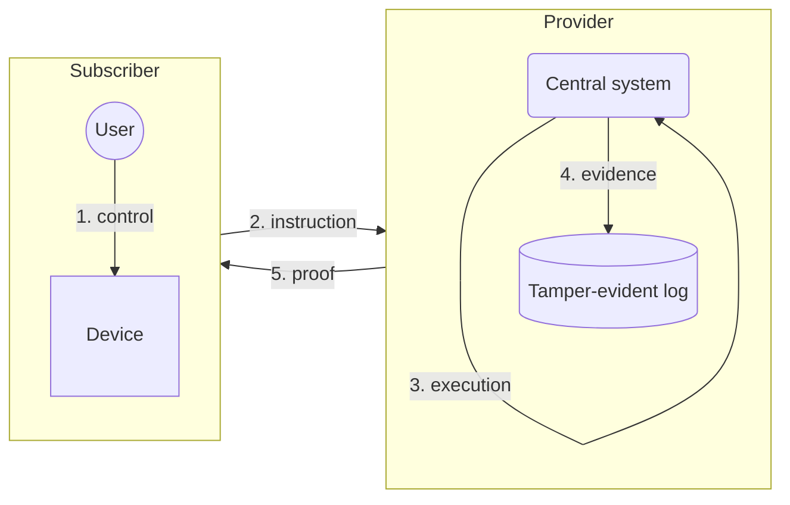

<h1 align="center"><br><br>Verify that systems operate under your sole control</h1>

**You need identity wallets and trust services to [participate securely in online society](https://repository.tudelft.nl/islandora/object/uuid%3A4c2005ea-9cfd-420f-80fb-e8714be0bdd5). Whether you are booking a holiday, signing a contract, or providing financial services. Underlying central systems mitigate risks of identity theft, fraud, and data loss. But you need assurance that these systems process user data only under their sole control. With SCAL3, [Vidua](https://vidua.nl/english/) empowers its users with this assurance made available on scale.**

Depending on the risks, wallet and trust service providers leverage central systems with a [sole control assurance level](https://www.enisa.europa.eu/publications/assessment-of-standards-related-to-eidas) (SCAL):

- SCAL1 systems authenticate users before operating on their data.
- SCAL2 systems also operate only on instructions linked to multiple authentication factors.
- SCAL3 systems also enable users to verify [tamper-evident logs](https://transparency.dev/) proving sole control.

Adoption of mobile wallets is accelerating with the “eIDAS 2.0” [European Digital Identity](https://commission.europa.eu/strategy-and-policy/priorities-2019-2024/europe-fit-digital-age/european-digital-identity_en) framework. But the phones in use today are not equipped for security at scale. Users will therefore rely on central systems for cryptography, for example [hardware security modules](https://en.wikipedia.org/wiki/Hardware_security_module) (HSMs). With the increasing reach and impact of such technology, only the transparency of SCAL3 puts users truly in control.

## Prove sole control with SCAL3

1. A subscribed user is enrolled using a device they control.
2. The user authorizes an instruction, for example by entering a PIN code.
3. The provided system only executes instructions generated using multi-factor authentication.
4. The provider keeps a tamper-evident log with evidence of instructions.
5. Upon request, the provider proves that a particular operation was authorized.



## Verify transparent systems

Publishing open source code is not enough. To verify if the system does what its provider claims, you need to check its actual behaviour.

Providers with SCAL3 enable users to verify that their systems only operated upon sole control. Under normal circumstances, the provider can prove that each operation has an instruction that was generated by an authentic subscriber.

If anyone suspects compromise or corruption, they can easily investigate and make their case. All evidence of instructions is available in a tamper-evident log.

This empowers users with cryptographic proof.

## Two ways to achieve SCAL3

1. Using the [SECDSA](https://eprint.iacr.org/2021/910) [technology](https://www.cs.ru.nl/E.Verheul/presentations/SECDSA%20Assissted%20Wallet%200.31.pdf). This technology is based on algorithms that were invented in 2021 and patented by Eric Verheul. Users verify evidence by applying homomorphic encryption.
2. The method presented below. With this SCAL3 solution, users verify evidence using open standard ECDSA and ECSDSA signature verification.

In 2023, [Cleverbase](https://cleverbase.com/en/) experimented with both solutions. In 2024, the [Vidua](https://vidua.nl/english/) identity wallet is rolling out solution 2 to its users. By enabling verification using open standards, this method makes it easy for users to verify the tamper-evident logs.

## How it works

> [!NOTE]
> Patent NL2037022 pending. For inquiries, [contact Cleverbase](mailto:sander.dijkhuis@cleverbase.com).

Upon enrolment, the central system provider issues a certificate with two authentication factors:

- 🔑 Something you have: an ECDSA key bound to a device.
- 💭 Something you know or are: a PIN code or biometry-protected data.

The second factor is protected using [Shamir’s secret sharing](https://dl.acm.org/doi/10.1145/359168.359176) technique. The certificate enables verification by protecting:

- 🫱 A secret share encrypted using the second authentication factor.
- 🫲 A secret share encrypted with a user-specific key only known to the provider.
- 🤝 A verification key enabling ECSDSA signature verification using both secret shares.

Subscribers generate instructions and providers prove them using an innovative method combining:

- Multi-party computation of signatures proving the second factor
- Digital signatures proving possession of the enrolled device
- Digital signatures binding the two authentication factors

Using the certificate, anyone can verify a proof of multi-factor authentication using open standards from the [SOG-IS Agreed Cryptographic Mechanisms v1.3](https://www.sogis.eu/uk/supporting_doc_en.html).

## Technical details

### Tamper-evident log record format

Each tamper-evident log record is based on an ephemeral ECDSA key pair `(binding_sk, binding_vk)` generated on the user’s device. It contains an ECSDSA signature proving the second authentication factor using [FROST](https://eprint.iacr.org/2020/852) two-round threshold signing.

```
<message> || <user_sig> || <checksum> || <device_sig> || <binding_sig>
```

- `message`: `<binding_vk> || <log metadata> || <instruction>`
- `user_sig`: `ecsdsa(<message>)` represented as `c || z`
- `checksum`: `sha256(<user signature share>)`
- `device_sig`: `ecdsa(<c> || <checksum>)` created with `device_sk`
- `binding_sig`: `ecdsa(<device_sig>)` created with `binding_sk`

### Authentication protocol

1. Provider commits in FROST.
2. Provider shares its commitments with Subscriber in a challenge.
3. Subscriber commits in FROST, completing the first FROST round.
4. Subscriber generates `(binding_sk, binding_vk)`.
5. Subscriber forms the `message` to sign.
6. Subscriber signs in FROST to create `c` and `user signature share`.
7. Subscriber computes the hash digest `checksum`.
7. Subscriber creates the device signature `device_sig`.
8. Subscriber creates the binding signature `binding_sig`.
9. Subscriber destroys `binding_sk`.
10. Subscriber responds to Provider with the results.
11. Provider validates the input and verifies the signatures.
12. Provider signs in FROST, completing the second FROST round.
13. Provider aggregates the `user_sig` in FROST.
14. Provider writes the record to the tamper-evident log.
