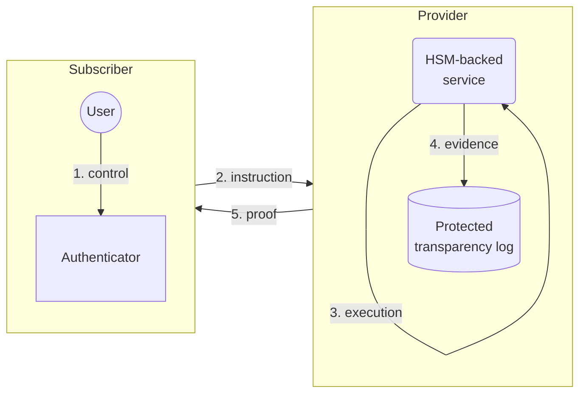

# Transparency Logs for SCAL3

**Author:** [Sander Dijkhuis](mailto:sander.dijkhuis@cleverbase.com) ([Cleverbase](https://cleverbase.com/en/)) \
**License:** [Creative Commons Attribution 4.0 International](https://creativecommons.org/licenses/by/4.0/)

This technical note about Sole Control Assurance Level 3 (SCAL3) explores the relation to the existing Transparency Log (tlog) ecosystem. Ideally this leads to acknowledgement of SCAL3 as a valid tlog use case, and to reuse across tlog specs, code and implementations.

> [!NOTE]
> While the general introduction [Verify that systems operate under your sole control](README.md) refers to technology under known (pending) patent claims, which is also implemented in the [Rust prototype package](src/README.md), the current document can be read independently. Instead of the claimed mobile app-friendly mechanisms, such as the mechanism for the [Vidua](https://vidua.nl/english/) wallet, this document provides examples based on [FIDO standards](https://fidoalliance.org/specifications/).

## Verify sole control of HSM-backed keys

Cloud services for digital identity or currency wallets and for end-to-end encryption are often backed by HSMs. Such HSMs can provide non-exportable keys that resist high-potential attacks, while enabling users to recover access even after losing their local hardware.

For remote multi-user control of central HSM services, we can define security requirements along several [sole control assurance levels](https://www.enisa.europa.eu/publications/assessment-of-standards-related-to-eidas):

- SCAL1 systems authenticate users before operating on their HSM-backed keys.
- SCAL2 systems meet SCAL1 and additionally require specific user instructions that are cryptographically linked to evidence of multi-factor authentication.
- SCAL3 systems meet SCAL2 and additionally enable public verification of tlogs containing this cryptographic evidence.

The application of tlogs enables continuous monitoring and dispute handling between a HSM-backed service provider and its user community. An independent auditor or judge can rely on SCAL3 tlog data to verify if a particular HSM operation was indeed based on an instruction created by the user in a multi-factor authenticated session.

While SCAL2 could still be implemented using symmetric cryptography, for example comparing a hashed PIN and TOTP within the HSM, SCAL3 requires non-repudiability which implies asymmetric cryptography. This poses several security design challenges:

- After compromise of the user’s authentication device and with access to the tlog data, an attacker must not be able to verify brute-force PIN attempts offline. So the tlog must not provide any information about the PIN.
- User-specific instruction content or quantitive data must be kept confidential. So public tlog contents must not contain any personal data.

## Prove sole control with SCAL3

One solution is to use a FIDO authenticator with UAF, for example a [YubiKey](https://www.yubico.com/products/yubikey-5-overview/), acting as a [Multi-Factor Cryptographic Device](https://pages.nist.gov/800-63-3/sp800-63b.html#mfcd). To prove sole control:

1. A subscribed user is enrolled using the authenticator.
2. The user authorizes an instruction, for example by entering a PIN code.
3. The provided HSM-backed service only executes instructions generated using multi-factor authentication.
4. The provider keeps a protected tlog with evidence of instructions.
5. Upon request, the provider proves that a particular operation was authorized.



## Technical details

The `struct` notation is as defined in [RFC 5246](https://datatracker.ietf.org/doc/html/rfc5246) where `uint32` represents a big-endian 32-bit unsigned integer representation.

### Log record format

Each tlog record is based on an authenticator assertion based on client data. This specification assumes that the authenticator signs using an ECDSA key pair that was attested to the provider during enrollment.

```
struct {
    uint32 timestamp;
    uint32 nonce;
    opaque metadata[32];
    opaque authenticator[37];
    opaque signature[64];
    opaque instruction<0..2^10>;
} LogRecord;
```

`timestamp` is a timestamp generated by the provider in seconds since the UNIX epoch.

`nonce` is a random authentication challenge number to be used once, generated by the provider.

`authenticator` is authenticator data as returned by the authenticator per CTAP2, upon request of an assertion with the AT and ED flags not set.

`instruction` is a HSM-backed key management instruction, generated by the subscriber.

#### Log record `metadata`

`metadata` is a message authentication tag, defined as, where `hmac(<key>, <message>)` denotes computation of HMAC-SHA-256 with secret key `key`, as:

```
hmac(<shared_key>,
     <number> || hmac(<subscriber_key>,
                      <timestamp> || <nonce> || <context>))
```

`shared_key` is a 32-byte shared secret key between provider and subscriber.

`number` is a `uint32` strictly increasing number starting at 0 upon enrollment of a subscriber, shared between provider and subscriber. This enables both parties to verify integrity of the protected tlog, without disclosing the amount of previously recorded instructions with others.

`subscriber_key` is a 32-byte secret key controlled by the subscriber.

`context` is an opaque byte array of length `0..2^10` that enables the subscriber to assign context data to the logged instruction for personal reference, for example indicating what document was signed.

#### Log record `signature`

`signature` is an authenticator assertion `ecdsa(<authenticator> || sha256(<client_data>))` as per CTAP2, where `client_data` is:

```
<timestamp> || <nonce> || <metadata> || <instruction>
```

- `number`: log sequence number, maintained between subscriber and provider (4 bytes, see below)

### Authentication protocol

1. Provider determines `key` and `timestamp`.
2. Provider generates `nonce`.
3. Provider shares `key`, `timestamp` and `nonce` with Subscriber in a challenge.
4. Subscriber determines `instruction`, `context`, and `client_data`.
5. Subscriber creates `authenticator` and `signature` using their authenticator.
6. Subscriber responds to Provider with the results.
7. Provider validates the input and verifies the signatures.
8. Provider writes the record to the protected tlog.

After successful authentication and subsequent authorization, Provider executes `instruction` and returns the result.

## Acknowledgements

The usage of a log sequence number shared between the subscriber and provider is inspired by the [NL Wallet Solution Architecture v1.0.3 draft](https://edi.pleio.nl/files/view/dc585f22-ca66-4892-87c5-c7bdb2dd69b4/nlw-solution-architecture-sad-v1.pdf) by [MinBZK](https://github.com/MinBZK).

## Open design issues

- [ ] Next to the protected tlog, should a SCAL3 provider record into a public tlog?
    - For example to record provider signatures: `ecdsa(sha256(<protected tlog entry>) || sha256(<instruction result>))`.
- [ ] The current tlog record design looks awkward, are there best practices?
- [ ] Can we improve the terminology to align with existing tlog ecosystems?
